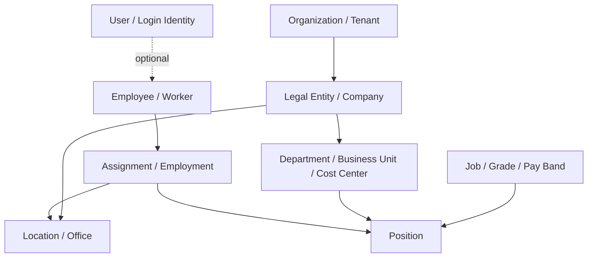
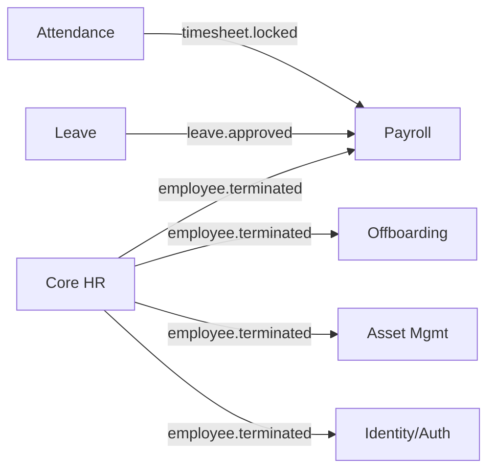
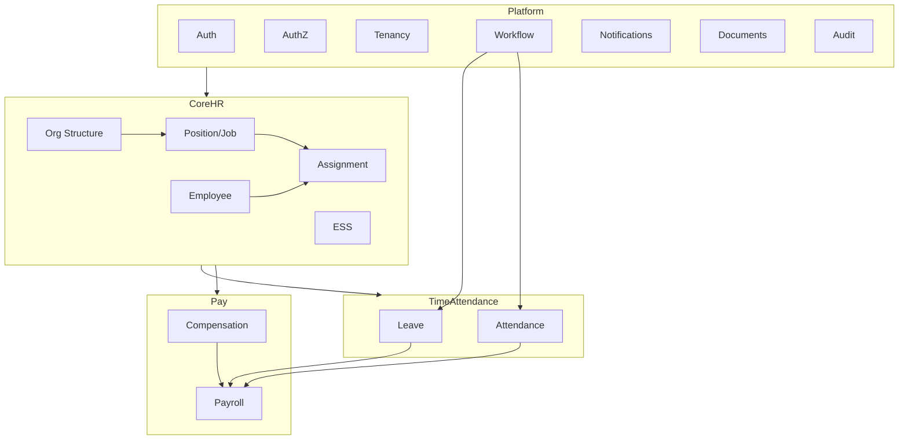

# Modular HRMS — Build Plan

> A plan for building a Human Resource Management System that stays coherent from MVP to enterprise scale. Architecture follows [architecture.md](architecture.md); the module boundaries here are the thing that keeps it from crumbling.

---

## 1. Vision & Non-Negotiables

We are building a **modular monolith** HRMS: one deployable system, internally partitioned into strict modules that can each be extracted into a service later *without a rewrite*. The goal is not microservices on day one — it's the **option** to split any module the day it earns it.

Five non-negotiables. Break one and the system crumbles as it grows:

1. **Each module owns its data.** No other module reads its tables directly. Cross-module access goes through a published interface (a service method or an event), never a JOIN.
2. **No cross-module database foreign keys.** Modules reference each other by ID only. This is what makes a module extractable later — a DB-level FK is a weld.
3. **The employee record is referenced, never copied — except as an immutable snapshot.** Live data is referenced by `employeeId`. Historical records (a payslip, a closed review) snapshot the values they depended on, because history must not change when the employee does.
4. **Effective-dated from day one.** HR data is temporal. A salary, a department, a manager — all have a "valid from / valid to". Retrofitting this later is a multi-month migration; building it in is a column.
5. **Configuration is data, not code.** Leave policies, approval chains, pay components, and grades differ per tenant. They live in tenant-scoped tables, not in `if` statements.

---

## 2. Architectural Foundation

This plan instantiates the [architecture.md](architecture.md) playbook. The key mapping:

- **`core/` bucket** → the **Platform layer** (auth, tenancy, RBAC, notifications, workflow engine, audit, files). Every HR module depends on it; it depends on no HR module.
- **`modules/` bucket** → the **HR domain modules** (employee, leave, payroll, …). They depend on `core/` and communicate with each other only via events and published service interfaces.
- **`shared/`** → the domain contract types (IDs, enums, event payloads) both backend and frontend import.

The three structural rules from the playbook that matter most here:

| Rule | HRMS consequence |
|---|---|
| Two-bucket backend (`core/` vs `modules/`) | Auth/tenancy never leaks into Payroll; Payroll never becomes load-bearing for another module |
| Feature module is self-contained | "Leave" owns its UI, state, service, tables, and tests — you can staff one team per module |
| Events for side effects, not direct calls | `employee.terminated` fans out to Offboarding, Payroll, Assets — none of them are wired into Core HR |

---

## 3. The Domain Spine

Everything in an HRMS hangs off a small set of backbone entities. Get these relationships right and the modules slot in cleanly; get them wrong and every module inherits the mistake.



Three modeling decisions that prevent the most common HRMS rot:

### 3.1 `User` is not `Employee`
A **User** is a login identity (credentials, sessions, MFA). An **Employee** is an HR record. They are separate tables with an optional link.
- Not every user is an employee (external recruiters, auditors, support admins).
- Not every employee is a user (deskless / frontline workers with no login).
- An employee can be rehired — same person, new employment — without a new login, or vice versa.

Conflating them is the single most expensive mistake to unwind later.

### 3.2 `Assignment` sits between `Employee` and `Position`
An employee doesn't "have a job" — they hold an **assignment** to a position, with an effective date range. This one indirection models, for free:
- Transfers and promotions (close one assignment, open another)
- Acting / dual roles (two concurrent assignments)
- Secondments, contract→permanent conversion, rehires
- Accurate org-chart history ("who reported to whom in March 2024")

### 3.3 Effective-dated records
Backbone facts (assignment, salary, manager, department) carry `validFrom` / `validTo`. Queries ask "as of date X". This is what lets Payroll compute April correctly even after a May reorg, and what lets reports be reproducible.

---

## 4. Module Catalog  ⟵ review this

> **This is the list to check for gaps.** Modules are grouped by layer. "Essential" = the basic HRMS most orgs need on day one; "Extended" = the broader HCM suite you grow into. Tell me what's missing or mis-prioritized.

### 4.1 Platform / Foundation layer (`core/`)

These are infrastructure — built first, depended on by everything.

| Module | Essential | Owns (key entities) | Notes |
|---|:---:|---|---|
| **Identity & Auth** | ✅ | User, Session, Credential, ApiKey | SSO (SAML/OIDC), MFA, password policy |
| **Authorization (RBAC/ABAC)** | ✅ | Role, Permission, Policy, Scope | Role + attribute + **data scoping** (own/team/dept/org) |
| **Tenancy & Organization** | ✅ | Organization, LegalEntity, Location, Department, CostCenter | Tenant isolation; org settings |
| **Position & Job** | ✅ | Job, Grade, PayBand, Position, JobFamily | The structure assignments attach to |
| **Workflow & Approval Engine** | ✅ | WorkflowDefinition, ApprovalChain, Task, Step | One engine; leave/expense/etc. configure it |
| **Notifications** | ✅ | NotificationTemplate, Channel, Preference, Delivery | Email, in-app, push, SMS |
| **Document & File Storage** | ✅ | Document, File, Version, AccessGrant | Object storage, e-signature hooks |
| **Audit Log** | ✅ | AuditEvent (append-only) | Immutable who-did-what-when |
| **Configuration / Policy Engine** | ✅ | PolicyDefinition, RuleSet (tenant-scoped) | Makes accrual/approval rules data |
| **Integration Hub & Public API** | ➕ | Webhook, Connector, ApiClient | Slack/Teams, calendars, finance, IdP sync |
| **Search & Indexing** | ➕ | (index infra) | Cross-module people/document search |

### 4.2 Core HR domain

The system of record. Built second; the spine for everything after.

| Module | Essential | Owns (key entities) | Depends on |
|---|:---:|---|---|
| **Employee / Core HR** | ✅ | Employee, PersonalInfo, ContactInfo, EmploymentHistory, Dependent | Tenancy, Position |
| **Assignment Management** | ✅ | Assignment, Transfer, Promotion, ReportingLine | Employee, Position |
| **Self-Service (ESS/MSS)** | ✅ | (experience layer; profile edits, requests) | Employee, Workflow |
| **Onboarding** | ➕ | OnboardingPlan, Checklist, Task, ProvisioningRequest | Employee, Workflow, Documents |
| **Offboarding / Separation** | ➕ | SeparationCase, ClearanceChecklist, ExitInterview | Employee, Assets, Payroll, Workflow |

### 4.3 Time & Attendance domain

| Module | Essential | Owns (key entities) | Depends on |
|---|:---:|---|---|
| **Leave & Absence** | ✅ | LeaveType, LeaveBalance, Accrual, LeaveRequest, HolidayCalendar | Employee, Workflow, Config |
| **Attendance & Time Tracking** | ✅ | TimeEntry, Timesheet, Regularization, ClockEvent | Employee, Workflow |
| **Shift & Roster Scheduling** | ➕ | Shift, Roster, RotationPattern, ShiftSwap | Employee, Location |
| **Overtime Management** | ➕ | OvertimeRule, OvertimeClaim | Attendance, Config |

### 4.4 Talent Acquisition & Development

| Module | Essential | Owns (key entities) | Depends on |
|---|:---:|---|---|
| **Recruitment / ATS** | ➕ | Requisition, Candidate, Application, Interview, Offer | Position, Workflow, Documents |
| **Performance Management** | ➕ | Goal/OKR, ReviewCycle, Appraisal, Feedback, Rating | Employee, Assignment |
| **Learning & Development (LMS)** | ➕ | Course, Enrollment, Certification, SkillMatrix | Employee |
| **Competency & Skills** | ➕ | Competency, SkillProfile, Proficiency | Employee, Position |
| **Succession & Career** | ➕ | TalentPool, SuccessionPlan, CareerPath | Employee, Performance |

### 4.5 Compensation & Payroll

| Module | Essential | Owns (key entities) | Depends on |
|---|:---:|---|---|
| **Compensation Management** | ✅ | SalaryStructure, PayComponent, SalaryRevision, Increment | Employee, Grade |
| **Payroll** | ✅ | PayRun, Payslip (snapshot), TaxRule, StatutoryDeduction | Compensation, Attendance, Leave |
| **Benefits Administration** | ➕ | BenefitPlan, Enrollment, Coverage, Dependent | Employee |
| **Expense & Reimbursement** | ➕ | ExpenseClaim, ExpenseItem, Reimbursement | Employee, Workflow |
| **Loans & Advances** | ➕ | LoanRequest, RepaymentSchedule | Employee, Payroll |

### 4.6 Employee Services & Compliance

| Module | Essential | Owns (key entities) | Depends on |
|---|:---:|---|---|
| **HR Helpdesk / Case Management** | ➕ | Ticket, Case, SLA, KnowledgeArticle | Employee, Workflow |
| **Compliance & Statutory** | ➕ | StatutoryReport, ComplianceTask, RegulatoryFiling | Employee, Payroll |
| **Asset Management** | ➕ | Asset, Allocation, ReturnRecord | Employee, Offboarding |
| **Engagement & Surveys** | ➕ | Survey, PulseCheck, eNPSResult | Employee |
| **Travel Management** | ➕ | TravelRequest, Itinerary, TravelExpense | Employee, Expense, Workflow |
| **Health, Safety & Incidents** | ➕ | Incident, SafetyReport, Inspection | Employee, Location |

### 4.7 Insight layer

| Module | Essential | Owns (key entities) | Depends on |
|---|:---:|---|---|
| **Reporting, Dashboards & People Analytics** | ✅ | Report, Dashboard, Metric, DataExport | Read-only across all modules (via read models) |

---

## 5. Inter-Module Communication — why it scales

This section is the heart of "doesn't crumble." Modules interact through exactly three sanctioned channels.

### 5.1 Published service interface (synchronous read)
When Leave needs an employee's manager *right now* (to route an approval), it calls `EmployeeDirectory.getManager(employeeId)` — a published interface, not a SQL JOIN into the employee tables. The interface is a contract; the storage behind it is private.

### 5.2 Domain events (asynchronous side effects)
State changes are announced, not orchestrated. The publisher doesn't know or care who listens.



Core HR emits `employee.terminated` and moves on. Offboarding opens a clearance case, Payroll triggers final settlement, Assets flags returns, Auth disables the login — none of them are referenced in Core HR's code. Add a new listener (e.g. Benefits) without touching the publisher.

### 5.3 Snapshots for history (the temporal rule)
A payslip is **immutable** and stores the values it was computed from — name, department, salary, tax codes *as of that pay run*. It references `employeeId` for lineage but never re-reads live data to render. So a 2024 reorg cannot rewrite a 2023 payslip. The same applies to closed performance reviews, signed offer letters, and filed statutory reports.

> **Rule of thumb:** live operational data → reference by ID. Anything legal, financial, or audited → snapshot at the moment of record.

### 5.4 What is explicitly forbidden
- ❌ A module reading another module's tables (no shared DB JOINs across module boundaries).
- ❌ A cross-module foreign-key constraint.
- ❌ A synchronous call chain three modules deep (Leave → Payroll → Tax). Use an event.
- ❌ Duplicating live employee fields (name, email) into another module's tables as the source of truth.

---

## 6. Cross-Cutting Concerns

| Concern | Approach |
|---|---|
| **Multi-tenancy** | Tenant ID scoped at the repository layer (or row-level security). Code *cannot forget* to scope — it's the default, opt-out is explicit and audited. |
| **Authorization** | Role + attribute + **data scope** (self / team / department / legal-entity / org). Payroll-admin for Entity A ≠ for Entity B. Enforced in services, not just UI. |
| **Privacy & PII** | Personal data is classified; field-level encryption for sensitive fields (SSN, bank, health); right-to-erasure honored via per-module deletion handlers triggered by an event. |
| **Compliance & locale** | Multi-currency, multi-country statutory rules, multi-language. Country-specific payroll/leave logic lives behind a strategy interface, never branched inline. |
| **Auditability** | Every mutation to employee, comp, and payroll data writes an append-only audit event. Non-negotiable for HR. |
| **Configurability** | Approval chains, leave accrual, pay components, grades — all tenant-configurable data driving generic engines. |

---

## 7. Repository & Package Structure

Concrete instantiation of the playbook's monorepo layout:

```
packages/
├── shared/                 # contract types, IDs, enums, event payloads
├── ui/                     # design-system primitives + theme (see design.md)
├── api/                    # the modular-monolith backend
│   └── src/
│       ├── core/           # platform layer (§4.1)
│       │   ├── auth/
│       │   ├── authz/
│       │   ├── tenancy/
│       │   ├── workflow/
│       │   ├── notifications/
│       │   ├── documents/
│       │   └── audit/
│       └── modules/        # HR domain (§4.2–4.7)
│           ├── employee/
│           ├── assignment/
│           ├── leave/
│           ├── attendance/
│           ├── compensation/
│           ├── payroll/
│           └── …
├── worker/                 # background jobs (payroll runs, accruals, reports)
├── web/                    # frontend SPA — feature module per HR module
├── emails/                 # payslip, offer, approval email templates
├── sdk/                    # public API client (for the Integration Hub)
└── e2e/                    # cross-module end-to-end tests
```

Each backend module follows the §2.2 anatomy (`*.module / *.resolver / *.service / *.entity / dto/ / guards/`). Each frontend feature follows §5.1 (`components/ hooks/ states/ graphql/ services/`).

---

## 8. Delivery Roadmap

Build order is dictated by the dependency graph, not by feature excitement. Each phase ships something usable.

| Phase | Modules | Outcome |
|---|---|---|
| **0 — Platform** | Auth, AuthZ, Tenancy, Workflow engine, Notifications, Documents, Audit, Config | A secure, multi-tenant shell with login, roles, approvals, and an audit trail. No HR yet. |
| **1 — Core HR spine** | Org Structure, Position/Job, Employee, Assignment, ESS/MSS shell | Employees exist, org chart works, people can log in and see their profile. The system of record. |
| **2 — Time off & attendance** | Leave, Attendance, Holiday Calendar | Daily-use value; first real exercise of the workflow engine and accrual config. |
| **3 — Pay** | Compensation, Payroll, Payslips | The hardest, highest-stakes module. Consumes Leave + Attendance as inputs; proves the snapshot model. |
| **4 — Lifecycle & talent** | Onboarding, Offboarding, then Recruitment, Performance, LMS | Closes the hire-to-retire loop; reacts to employee lifecycle events. |
| **5 — Services & insight** | Helpdesk, Expenses, Benefits, Assets, Analytics, Compliance | The breadth that turns an HRMS into an HCM suite. |

**Why this order:** Payroll (Phase 3) depends on Leave and Attendance (Phase 2) for its inputs and on Compensation for rates — but all three depend on the Employee spine (Phase 1), which is meaningless without the platform (Phase 0). Talent and services modules are mostly downstream listeners, so they come last and can be parallelized across teams once the spine is stable.

---

## 9. Scaling Playbook

How the structure responds as load and team size grow — without a rewrite:

| Pressure | Response enabled by the architecture |
|---|---|
| A module gets hot (e.g. Attendance at clock-in spikes) | Extract it to its own service — it already has a clean interface and no cross-module FKs. Only the transport changes (in-process call → RPC/event). |
| Payroll runs take too long | It's already async in `worker/`. Shard pay runs by legal entity; they're independent. |
| One team becomes many | Each module is self-contained — assign module ownership, add CODEOWNERS, no shared-file contention. |
| Reporting queries strain the operational DB | Analytics reads from **read models / a warehouse** fed by events, never from live module tables. Separate the read path early. |
| A new country / regulation | Add a country strategy behind the existing interface; no change to the generic payroll/leave engine. |
| Tenant data grows huge | Tenancy is scoped at the data layer — partition or shard by tenant without touching module code. |

The throughline: because modules never reach into each other's data and never hold cross-module FKs, **any module can become a service the day it needs to**, and that day's work is plumbing, not redesign.

---

## 10. Risks & Open Questions

- **Payroll is a product in itself.** Country-specific tax/statutory logic is deep. Decide early: build per-country, or integrate a specialized payroll provider via the Integration Hub.
- **Effective-dating discipline.** It only works if *every* backbone write respects it. Needs a shared temporal base entity and lint/review enforcement from commit #1.
- **Event reliability.** Side effects ride on events, so the event bus needs an outbox pattern (transactional publish) and idempotent consumers — otherwise a missed `employee.terminated` leaves a ghost login.
- **Org restructures.** Bulk department/manager changes must be effective-dated batch operations, not row-by-row edits, or history fragments.
- **The User/Employee link** must be designed before Phase 1 — it's load-bearing for both Auth and Core HR.

---

## Appendix — Module Dependency Overview



---

### Your move

The **basics** I'm treating as the day-one HRMS (the ✅ rows): Auth, AuthZ, Tenancy, Workflow, Notifications, Documents, Audit, Config, Org Structure, Position/Job, Employee, Assignment, ESS/MSS, Leave, Attendance, Compensation, Payroll, and core Reporting.

Everything marked ➕ (Recruitment, Performance, LMS, Benefits, Expenses, Helpdesk, Assets, Compliance, Surveys, Travel, Safety, Succession…) is the broader suite to grow into.

**Tell me what's missing, what you'd promote from ➕ to ✅, or what doesn't belong** — and I'll revise the catalog and roadmap.
